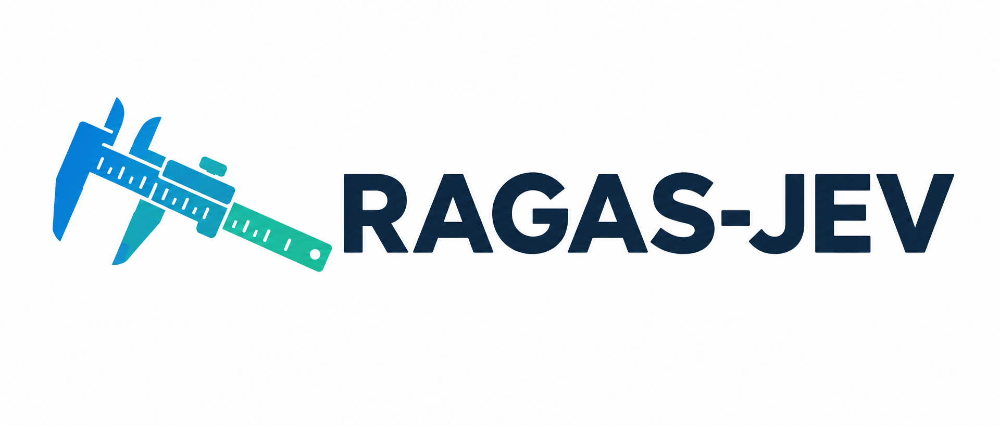
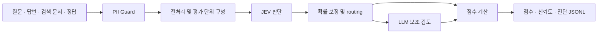

<p align="center">
  
</p>

<h1 align="center">RAGAS-JEV</h1>

<p align="center">
  <strong>RAG의 검색 품질과 답변 신뢰도를, 판단 근거와 함께 평가하세요.</strong>
</p>

<p align="center">
  <a href="#빠른-시작">빠른 시작</a> ·
  <a href="#평가-지표">평가 지표</a> ·
  <a href="docs/RAGAS-JEV_설계방향.md">설계 문서</a> ·
  <a href="docs/reports/phase6_benchmark.md">벤치마크</a> ·
  <a href="docs/도메인_재보정_가이드.md">재보정 가이드</a>
</p>

---

**RAGAS-JEV**는 JEV(TypeSafe System One)를 Primary Judge로 사용하는 RAG 평가 도구입니다. [Ragas](https://github.com/vibrantlabsai/ragas)의 주요 평가 축을 바탕으로, 생성형 LLM의 전처리와 JEV의 판단, 프로그램의 점수 계산을 분리한 자체 파이프라인을 제공합니다.

> LLM은 문제를 나누고, JEV는 판단하고, 프로그램은 점수를 계산한다.

질문·답변·검색 문서를 JSONL로 입력하면 검색 품질과 답변 품질을 평가합니다. 점수뿐 아니라 평가 단위별 확률, confidence, uncertainty, 판단 출처를 남겨 낮은 점수의 원인을 확인할 수 있습니다.

## 주요 기능

- **네 가지 평가 지표** — Context Precision, Context Recall, Faithfulness, Answer Relevancy로 검색과 생성을 함께 평가합니다.
- **평가 단위별 진단** — 답변의 claim·statement와 검색 chunk별 판정, 수치 대조 정보를 확인합니다.
- **불확실한 판단 재검토** — 확률 보정과 routing 정책을 적용하고, 필요한 판정을 LLM Auditor 또는 Strong Judge로 보냅니다.
- **사람 검토와 도메인 재보정** — JEV와 LLM의 불일치를 CSV로 검토하고, 도메인 라벨로 확률 보정을 다시 학습합니다.
- **반복 실행 지원** — 판정·추출 캐시와 JSONL 체크포인트로 결과를 재사용하고 중단된 평가를 이어갑니다.
- **오프라인 실행** — MockJudge와 문장 분리 추출기로 외부 API 없이 파이프라인을 확인합니다.

## 동작 방식



생성형 LLM은 claim과 statement를 추출합니다. JEV는 각 단위의 지원 여부와 관련성을 판단하고, scorer는 확정된 판정값으로 점수를 계산합니다. Context Precision은 검색 chunk를 직접 평가합니다. 상세 구조는 [설계 문서](docs/RAGAS-JEV_설계방향.md)를 참고하세요.

## 설치

기본 실행에는 **Python 3.10 이상**과 **uv**가 필요합니다. 저장소 루트에서 실행하세요.

```bash
uv sync
```

외부 API를 사용하려면 `.env.example`을 `.env`로 복사합니다. 기존 `.env`가 있다면 필요한 설정만 확인하세요.

```powershell
# Windows PowerShell
Copy-Item .env.example .env
```

```bash
# macOS / Linux
cp .env.example .env
```

| 설정 | 용도 |
|---|---|
| `OPENAI_BASE_URL` | 사용하는 LLM 프록시 주소 |
| `OPENAI_API_KEY` | 프록시 인증 설정 |
| `OPENAI_MODEL` | 전처리에 사용할 모델 |
| `TYPESAFE_API_KEY` | JEV API 인증 키 |
| `TYPESAFE_DEFAULT_MODEL` | JEV 모델 버전. 기본값은 `jev-1.13.0` |

역할별 모델과 캐시·PII 설정은 [.env.example](.env.example)을 참고하세요. 예제의 `RAGAS_JEV_CONF_ACCEPT`와 `RAGAS_JEV_CONF_AUDIT`를 그대로 설정하면 공통 routing 임계값이 적용됩니다. Phase 5의 **지표별 routing 정책**을 사용하려면 두 변수를 `.env`와 실행 환경에서 제거하세요.

## 빠른 시작

### 1. 외부 API 없이 실행해 보기

저장소의 한국어 합성 데이터로 입력부터 결과 저장까지 확인합니다. API 키 설정은 필요하지 않습니다.

```bash
uv run ragas-jev evaluate -i benchmark/datasets/smoke_ko.jsonl -o results/mock.jsonl --judge mock --extractor sentence --no-audit --no-calibration
```

MockJudge의 점수는 동작 확인용입니다. 실제 품질 평가에는 아래 JEV 실행을 사용하세요.

### 2. 연결 확인 및 JEV 평가

`.env` 설정 후 프록시와 JEV 연결을 확인하고 평가합니다. 연결 확인에는 합성 입력만 사용합니다.

```bash
uv run ragas-jev healthcheck
uv run ragas-jev evaluate -i benchmark/datasets/smoke_ko.jsonl -o results/smoke.jsonl
```

기본 실행은 LLM 추출기, JEV Judge, 확률 보정, LLM 보조 검토를 사용합니다. 결과는 샘플당 한 줄씩 JSONL에 추가되며, 같은 출력 파일로 재실행하면 이미 기록된 `sample_id`를 건너뜁니다. 설정을 바꿔 비교할 때는 새 출력 파일을 지정하세요.

### 3. 필요한 지표만 실행하기

```bash
uv run ragas-jev evaluate -i data.jsonl -o results/selected.jsonl --metrics context_precision,faithfulness

# LLM 보조 판단 없이 JEV로 평가 (LLM 전처리는 유지)
uv run ragas-jev evaluate -i data.jsonl -o results/jev_only.jsonl --no-audit

# 전체 옵션 확인
uv run ragas-jev evaluate --help
```

## 입력과 결과

입력은 **한 줄에 하나의 JSON 객체**를 담은 JSONL 파일입니다.

```json
{"sample_id":"q-1","question":"대한민국의 수도는 어디인가요?","answer":"대한민국의 수도는 서울입니다.","contexts":["서울은 대한민국의 수도이다."],"reference":"서울"}
```

| 필드 | 필수 | 설명 |
|---|:---:|---|
| `sample_id` | ✓ | 재개 시 중복 확인에 사용하는 고유 ID |
| `question` | ✓ | 사용자 질문 |
| `answer` | ✓ | 평가할 RAG 답변 |
| `contexts` | ✓ | 검색 순서대로 나열한 문서 문자열 배열 |
| `reference` | | 정답 또는 참조 답변 |
| `metadata` | | 추가 정보를 담는 객체 |

결과의 `retrieval`과 `generation`에는 지표별 점수가, `confidence`와 `uncertainty`에는 판단 신뢰도 정보가 저장됩니다. `units`에서 평가 단위, 확률 분포, 판단 출처와 보조 검토 정보를 확인할 수 있습니다. 전체 형식은 [결과 스키마](src/ragas_jev/schemas.py)를 참고하세요.

`reference` 없이 Context Recall을 요청하면 해당 점수는 `null`, 사유는 `no_reference`, 샘플 상태는 `partial`로 기록됩니다. `status`는 `ok`, `partial`, `blocked_pii`, `error` 중 하나입니다.

## 평가 지표

| 지표 | 평가하는 질문 | 계산 및 진단 |
|---|---|---|
| **Context Precision** | 관련 검색 문서가 잘 검색되고 상위에 배치되었는가? | chunk 관련 확률 평균, 순위 가중 점수, AP |
| **Context Recall** | 정답에 필요한 정보가 검색 문서에 포함되어 있는가? | reference claim 지원 확률 평균, 이진 점수 |
| **Faithfulness** | 답변의 주장이 검색 문서로 뒷받침되는가? | claim 지원 확률 평균, 이진 점수, 수치 대조 |
| **Answer Relevancy** | 답변이 질문과 관련 있는 내용을 전달하는가? | statement 관련 확률 평균, 답변 전체 scale 보조 점수 |

Context Precision은 `reference`가 있으면 reference를 사용하는 `chunk_relevance.v3`, 없으면 질문 기반 `v2` 문항을 사용합니다. Answer Relevancy의 주 점수는 statement 기반이며, 공식 Ragas의 역질문·임베딩 방식과는 계산 방식이 다릅니다.

같은 판정값에 대한 점수 계산은 결정적입니다. 다만 외부 모델의 응답은 재호출 시 달라질 수 있으므로, 반복 비교에는 캐시와 고정된 모델 버전을 사용하세요.

## 사람 검토와 도메인 재보정

JEV와 LLM이 반대로 판정한 unit을 CSV로 내보냅니다. `label` 열에 `1`(예) 또는 `0`(아니요)을 입력한 뒤 반영하면 해당 샘플을 재채점합니다.

```bash
uv run ragas-jev review export -i results/smoke.jsonl -o results/review.csv
# results/review.csv의 label 열을 검토·작성한 뒤 실행
uv run ragas-jev review import -i results/smoke.jsonl -l results/review.csv -o results/reviewed.jsonl
```

새로운 서비스 도메인에서는 라벨을 수집해 확률 보정을 다시 학습할 수 있습니다. 아래 `data.jsonl`과 `results/out.jsonl`은 도메인 데이터와 해당 데이터의 평가 결과입니다.

```bash
uv run ragas-jev calibration sample -r results/out.jsonl -s data.jsonl -o results/label_sheet.csv
# label 열을 작성한 뒤 실행
uv run ragas-jev calibration fit -l results/label_sheet.csv -o results/domain_calibration.json
uv run ragas-jev evaluate -i data.jsonl -o results/recalibrated.jsonl --calibration results/domain_calibration.json
```

보정 학습은 기본적으로 문항·언어 조합당 최소 100개 라벨이 필요합니다. 라벨링과 검증 절차는 [도메인 재보정 가이드](docs/도메인_재보정_가이드.md)를 참고하세요.

## 벤치마크와 구현 현황

Phase 1~6 구현 및 검증을 완료했습니다. 공식 Ragas, LLM Judge, JEV, Hybrid를 비교한 결과와 후속 검증은 아래 리포트에서 확인할 수 있습니다.

| 검증 단계 | 리포트 |
|---|---|
| Phase 1 · 검색 문서 관련성 | [Context Precision](docs/reports/phase1_context_precision.md) |
| Phase 2 · 답변 근거성 | [Faithfulness](docs/reports/phase2_faithfulness.md) |
| Phase 3 · 정답 정보 포함 여부 | [Context Recall](docs/reports/phase3_context_recall.md) |
| Phase 4 · 답변 관련성 | [Answer Relevancy](docs/reports/phase4_answer_relevancy.md) |
| Phase 5 · 확률 보정과 보조 판단 | [Routing & Calibration](docs/reports/phase5_routing_calibration.md) |
| Phase 6 · 종합 비교와 후속 검증 | [Benchmark](docs/reports/phase6_benchmark.md) |

결과는 각 리포트의 데이터셋과 설정에 대한 검증입니다. 서비스 도메인의 분포가 달라지면 기본 보정이 성능을 낮출 수 있어 별도 라벨과 재보정이 필요합니다. reference 기반 Context Precision과 임베딩 기반 Ragas Answer Relevancy의 후속 비교도 Phase 6 리포트에 포함되어 있습니다.

벤치마크 재현 환경에는 **Python 3.12**를 사용합니다.

```bash
uv sync --python 3.12 --all-groups
```

`benchmark` 그룹은 Ragas·PyArrow 등 비교 도구를, `embeddings` 그룹은 sentence-transformers 기반 로컬 임베딩을 설치합니다. 데이터 준비와 실행 명령은 각 리포트의 재현 절차를 따르세요.

## 개발과 테스트

```bash
uv sync --group dev
uv run pytest

# 실제 JEV API를 호출하는 테스트 (합성 데이터, 인증 설정 필요)
uv run pytest -m live
```

기본 테스트 실행에서는 `live` 테스트를 제외합니다. 변경 시 관련 unit·contract·integration 테스트와 문서를 함께 확인하세요.

## 데이터 보호

현재 구성의 LLM 프록시(OpenAI)와 JEV(TypeSafe)는 모두 국외 서비스입니다. 외부로 전송되는 텍스트는 기본 설정에서 PII Guard의 마스킹을 거칩니다. **실제 고객 데이터는 보안·법무 검토 전까지 사용하지 않으며, 공개·합성 데이터로만 평가합니다.**

## 관련 문서

- [설계 방향](docs/RAGAS-JEV_설계방향.md) — 역할 분리, 평가 지표, 불확실성 설계
- [구현계획서](docs/구현계획서.md) — 구성 요소와 단계별 구현·검증 기록
- [도메인 재보정 가이드](docs/도메인_재보정_가이드.md) — 라벨 수집과 보정 적용
- [Ragas 저장소](https://github.com/vibrantlabsai/ragas) — 평가 축과 README 구성 참고
